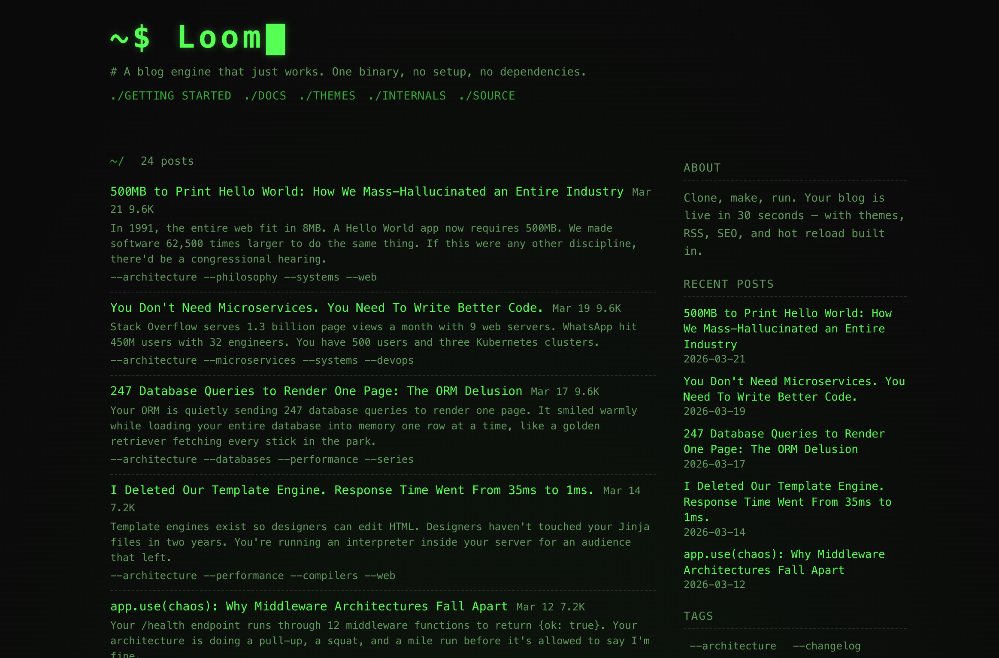

# loom

A zero-dependency C++20 blog engine. One binary, one content directory, one command.

Loom reads markdown, renders HTML, and serves it over HTTP — no frameworks, no build tools, no JavaScript bundlers. The HTTP server, markdown parser, router, and template engine are all written from scratch.

```
make && ./loom content/
```

That's it. Your blog is at `localhost:8080`.

The `content/` directory in this repo is a working example site — it's what you see at [loomblog.com](https://loomblog.com). Use it to try out themes, explore the config, or copy it as a starting point.



---

## Why

Every static site generator needs a build step, a deploy pipeline, and a runtime. Loom doesn't. It's a single binary that reads markdown and serves HTML. Hot reload is built in. Push a commit, the site updates.

## Features

- **Epoll-based HTTP server** — non-blocking I/O, TCP_NODELAY, keep-alive, trie-based router
- **Hand-written markdown parser** — headings, bold/italic, code blocks, tables, footnotes, task lists, strikethrough, images, reference links, raw HTML passthrough
- **Pre-rendered cache** — the entire site lives in memory, atomically swapped on content changes
- **Gzip + ETag** — compressed responses with HTTP 304 support out of the box
- **HTML minification** — automatic, zero config
- **Hot reload** — inotify-based filesystem watching with 500ms debounce, or git polling for commit-driven updates
- **21 built-in themes** — default, serif, mono, nord, solarized, dracula, gruvbox, catppuccin, tokyonight, kanagawa, and more — all with light/dark mode
- **RSS, sitemap, robots.txt** — generated automatically
- **Tags, series, archives** — first-class content organization with dedicated pages
- **Sidebar widgets** — recent posts, tag cloud, about text
- **Open Graph / SEO metadata** — og:tags, canonical URLs, structured data
- **Git source** — serve content directly from a git branch, no checkout needed
- **Strong types** — `Slug`, `Tag`, `Title`, `PostId`, `Content` — no stringly-typed domain logic
- **C++20 concepts** — `ContentSource`, `WatchPolicy`, `Reloadable` — the type system enforces contracts

## Quick Start

```bash
# build
make

# try the included example site immediately
./loom content/
```

Open `http://localhost:8080`. You're looking at a live blog — edit any file in `content/` and the site rebuilds instantly.

To start your own site, copy the example or create from scratch:

```bash
# option 1: copy the example as a base
cp -r content/ myblog/

# option 2: start from scratch
mkdir -p myblog/posts myblog/pages

# then run
./loom myblog/
```

```bash
# serve from a git repo instead of the filesystem
./loom --git /path/to/repo main content
```

## Content Structure

```
content/
├── site.conf            # site config
├── posts/
│   ├── hello-world.md
│   └── my-second-post.md
├── pages/
│   └── about.md
├── images/              # static assets, served as-is
│   └── cover.png
└── theme/
    └── style.css        # optional, overrides everything
```

Any file that isn't markdown or `site.conf` is served as a static asset. Put images, fonts, or downloads anywhere in `content/` and reference them by path (e.g. ``).

### Post frontmatter

```markdown
---
title: Why epoll beats select
date: 2024-03-10
slug: epoll-vs-select
tags: linux, networking, performance
draft: false
excerpt: Custom excerpt for social cards and listings
image: /images/epoll-cover.png
---

Your markdown here.
```

### Series

Series are defined by directory structure — create a subfolder inside `posts/`:

```
posts/
├── hello-world.md              # standalone post
├── systems-programming/        # ← series name
│   ├── epoll-vs-select.md
│   └── tcp-nodelay.md
└── type-safety/                # ← another series
    ├── strong-types.md
    └── phantom-types.md
```

Posts within a series are ordered by publish date (oldest first). No frontmatter needed.

### Page frontmatter

```markdown
---
title: About
slug: about
---

Page content.
```

## Configuration

`site.conf` uses `key = value` format:

```conf
title = My Blog
description = Thoughts on software engineering
author = Jane Doe
base_url = https://example.com

# Navigation bar
nav = Home:/, Archives:/archives, About:/about

# Theme (21 built-in — see Themes section below)
theme = nord

# Override individual theme variables
theme_font_size = 16px
theme_max_width = 800px

# Sidebar
sidebar_widgets = recent_posts, tag_cloud, about
sidebar_recent_count = 5
sidebar_about = Thoughts on software engineering, systems, and type theory.
sidebar_position = right

# Layout
header_style = default
post_list_style = cards
show_description = true
show_theme_toggle = true
show_post_dates = true
show_post_tags = true
show_excerpts = true
show_reading_time = true
date_format = %Y-%m-%d

# Footer
footer_copyright = &copy; 2024 Jane Doe
footer_links = GitHub:https://github.com/jane, RSS:/feed.xml

# Inject custom CSS or HTML
custom_css = body { letter-spacing: 0.02em; }
custom_head_html = <link rel="icon" href="/favicon.ico">
```

## Routes

| Path | Description |
|------|-------------|
| `/` | Post index |
| `/post/:slug` | Single post |
| `/tag/:slug` | Posts by tag |
| `/tags` | All tags |
| `/archives` | Posts by year |
| `/series` | All series |
| `/series/:name` | Posts in series |
| `/:slug` | Static page |
| `/feed.xml` | RSS 2.0 |
| `/sitemap.xml` | XML sitemap |
| `/robots.txt` | Robots |

## Themes

All 21 themes ship with light and dark variants. The toggle is automatic (respects `prefers-color-scheme`, with manual override persisted to localStorage).

| Theme | Font | Vibe |
|-------|------|------|
| `default` | System sans-serif | Clean, neutral grays, blue accent |
| `serif` | Georgia / Garamond | Editorial, warm tones, literary feel |
| `mono` | Monospace | Terminal aesthetic, green accent |
| `nord` | Inter / sans-serif | Arctic color palette, muted blues |
| `rose` | System sans-serif | Soft pinks, elegant, magenta accent |
| `cobalt` | System sans-serif | Deep blue, developer-friendly |
| `earth` | Charter / Georgia | Warm organic tones, olive accent |
| `hacker` | Monospace | Green on black, no border-radius, no frills |
| `solarized` | System sans-serif | Ethan Schoonover's precision-engineered palette |
| `dracula` | System sans-serif | The beloved dark-first theme, purple accent |
| `gruvbox` | System sans-serif | Retro groove, warm earthy contrast, orange accent |
| `catppuccin` | System sans-serif | Soothing pastels, purple accent |
| `tokyonight` | System sans-serif | Neon-tinged Tokyo evening palette |
| `kanagawa` | Charter / Georgia | Inspired by Hokusai's The Great Wave |
| `typewriter` | Courier New | Old-school ink-on-paper, raw and minimal |
| `brutalist` | System sans-serif | Anti-design, bold borders, red accent, uppercase |
| `lavender` | System sans-serif | Soft purple tones, warm and inviting |
| `warm` | Georgia / Charter | Golden amber palette, cozy reading feel |
| `ocean` | System sans-serif | Deep blue, calm and professional |
| `sakura` | System sans-serif | Cherry blossom pinks, delicate and refined |
| `midnight` | System sans-serif | Rich dark-first, electric blue, polished |

Override any theme with `content/theme/style.css` — it replaces the built-in CSS entirely.

## Git Source

Serve content from any git branch without touching the working tree:

```bash
# local repo, main branch, content in "content/" subdirectory
./loom --git . main content

# bare repo, custom branch
./loom --git /srv/blog.git production

# public GitHub remote — clones bare automatically
./loom --git https://github.com/you/blog.git main content
```

The git source uses `git show` and `git ls-tree` to read blobs directly — no checkout, no temp files. Hot reload polls for new commits and rebuilds automatically.

Post dates fall back to the first commit that introduced the file (`git log --diff-filter=A`). Modified timestamps use the last commit date. Both survive clones and CI rebuilds — unlike filesystem `mtime`.

### Images with a Remote Repo

When using a public GitHub remote, Loom redirects static asset requests to `raw.githubusercontent.com` instead of piping the bytes through your server:

```
GET /images/cover.png
→ 302 Location: https://raw.githubusercontent.com/you/blog/refs/heads/main/content/images/cover.png
```

Write image paths the same way in all modes — `/images/cover.png` works on filesystem, local git, and remote git. The redirect is automatic.

## Architecture

```
Request → Epoll → Router → AtomicCache snapshot → Gzip → Response
                               ↑
              HotReloader → build_cache() → atomic swap
                   ↑
        InotifyWatcher | GitWatcher
```

The site is pre-rendered into an immutable `SiteCache` struct on startup. Every request grabs a `shared_ptr` snapshot — zero contention on the read path. When content changes, a new cache is built and swapped atomically. In-flight requests continue serving from the old snapshot.

### Build

```bash
make            # g++, C++20, -O2
make clean
```

**Requirements:** Linux, g++ with C++20 support, zlib (`-lz`).

No cmake. No conan. No vcpkg. No submodules.

## Project Layout

```
src/
├── main.cpp                 # entry point, routing, cache orchestration
├── http/                    # epoll server, trie router, request/response
├── content/                 # filesystem + git content sources
├── render/                  # HTML rendering, themes, sidebar, layout
├── util/                    # markdown parser, config parser, gzip, minify, git
└── reload/                  # inotify watcher, git watcher, hot reloader

include/loom/
├── core/                    # strong types (Slug, Tag, Title, Content, PostId)
├── domain/                  # Site, Post, Page, Navigation, Theme, Footer
├── engine/                  # BlogEngine, site_builder
└── ...                      # mirrors src/ structure
```

## License

MIT
